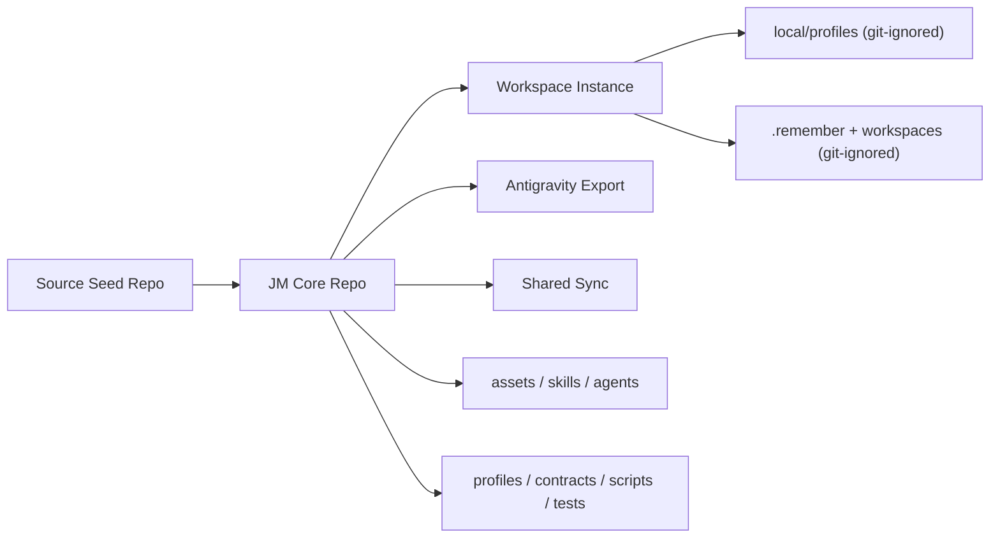

# System Map

## Reading Guide

- `JM Core Repo` is the only canonical source of reusable runtime.
- `Workspace Instance` is the operator-facing runtime and may carry local state.
- `local/profiles` and working memory are intentionally outside the sync and export boundary.
- `Antigravity Export` carries portable artifacts only.
- `Shared Sync` is narrower than the workspace and must remain allowlist-only.
